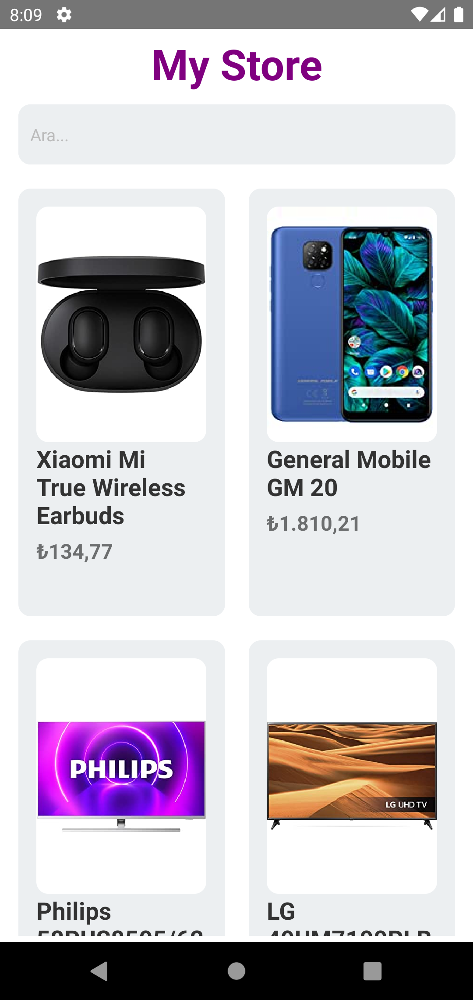

# myStoreApp

This is a simple News App. 
I used react native 0.65 version in this project.

<!DOCTYPE html>
<html>
  <head>
  </head>
  <body>
    <table><tr><td valign="top" width="33%">

  
  

</td><td valign="top" width="33%">

  
  

</td><td valign="top" width="33%">

## Connect with me  

  
</td></tr></table>
  </body>
</html>

